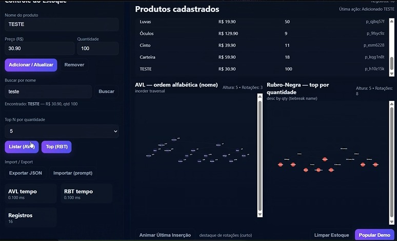
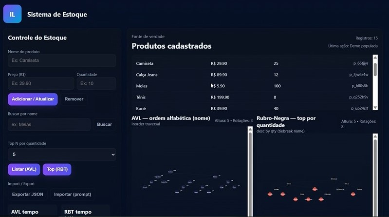

# Sistema de Estoque

## Alunos

| Matrícula  | Nome              |
| ---------- | ----------------- |
| 18/0019066 | Isabella Carneiro |
| 18/0105051 | Lívia Rodrigues   |

## 📦 Sistema de Estoque — AVL & Rubro-Negra (Visual)

Este projeto é um sistema de gerenciamento de estoque simples, desenvolvido puramente em **JavaScript, HTML e CSS**, com foco na visualização de estruturas de dados auto-balanceáveis: **Árvore AVL** e **Árvore Rubro-Negra (RBT)**.

Ele serve como uma demonstração interativa de como essas estruturas podem ser utilizadas para manter diferentes ordenações de um mesmo conjunto de dados.

---

## ✨ Funcionalidades Principais

- **Controle de Estoque:** Permite adicionar, atualizar e remover produtos (Nome, Preço e Quantidade).
- **Persistência:** Os dados são salvos automaticamente no `localStorage` do navegador.
- **AVL Tree:** Mantém os produtos ordenados por **Nome** (ordem alfabética).
- **Red-Black Tree (RBT):** Mantém os produtos ordenados por **Quantidade** (ordem decrescente), com desempate por nome.
- **Visualização Gráfica (SVG):** Exibe a estrutura e o balanceamento de ambas as árvores em tempo real após cada operação.
- **Métricas de Desempenho:** Exibe a altura, o número de rotações e o tempo de reconstrução de cada árvore após a inserção.
- **Funções de Listagem:**
  - **Listar (AVL):** Exibe a lista completa de produtos em ordem alfabética (percurso _In-Order_).
  - **Top (RBT):** Exibe os **N** produtos mais estocados (percurso descendente).

---

## 🏗️ Estruturas de Dados Implementadas

O sistema utiliza um `Map` central como "Fonte de Verdade" e reconstrói as árvores sempre que o estoque é modificado, demonstrando o custo e o processo de balanceamento:

| Estrutura             | Chave de Ordenação         | Propósito                                                       | Cor do Nó (RBT)   |
| :-------------------- | :------------------------- | :-------------------------------------------------------------- | :---------------- |
| **AVL Tree**          | Nome do Produto (String)   | Garantir busca rápida e listar em ordem alfabética.             | Roxo (Destaque)   |
| **Rubro-Negra (RBT)** | Quantidade + Nome (Objeto) | Ranking de estoque (Top N), mantendo o balanceamento eficiente. | Vermelho ou Preto |

---

## 🚀 Como Executar

Este projeto é totalmente _frontend_ e não requer _backend_ ou dependências externas.

1.  **Clone o repositório:**

2.  **Abra o arquivo:**
    Simplesmente abra o arquivo `t3.html` em qualquer navegador moderno (Chrome, Firefox, Edge, etc.).

3.  **Popule o Estoque:** Use o botão **"Popular Demo"** para carregar um conjunto inicial de dados e ver as árvores em ação imediatamente.

---

## ⚙️ Detalhes da Implementação (Código)

- **`AVLTree`:** Implementa o algoritmo padrão de inserção com cálculo de fator de balanço e quatro tipos de rotações (Simples Direita/Esquerda e Duplas LR/RL).
- **`RedBlackTree`:** Implementa a inserção com o uso de um nó sentinela `nil` e a lógica de correção (`insertFix`) para manter as propriedades da RBT através de recoloração e rotações.
- **`layoutTree` / `drawAVL` / `drawRBT`:** Funções responsáveis por calcular as coordenadas de cada nó com base na profundidade e no índice in-order, e desenhar a representação gráfica usando a API SVG.

**Observação:** O código captura os eventos de rotação (`avl.lastOps` e `rbt.lastOps`) durante a inserção, permitindo a animação de destaque via botão **"Animar Última Inserção"**.

## Capturas de tela

## Apresentação

**Algoritmos de Ordenação LeetCode** - [Link para a apresentação](https://youtu.be/RIXipAW55Vc)
